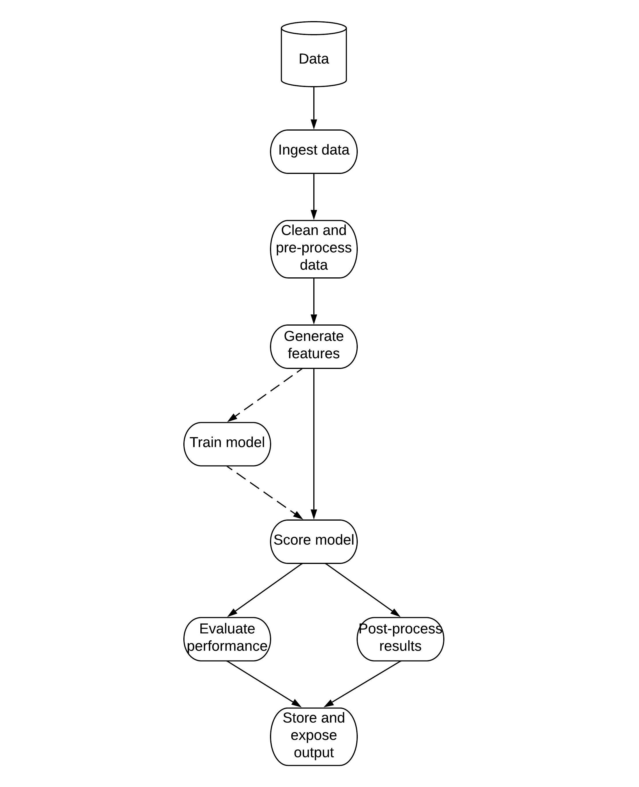
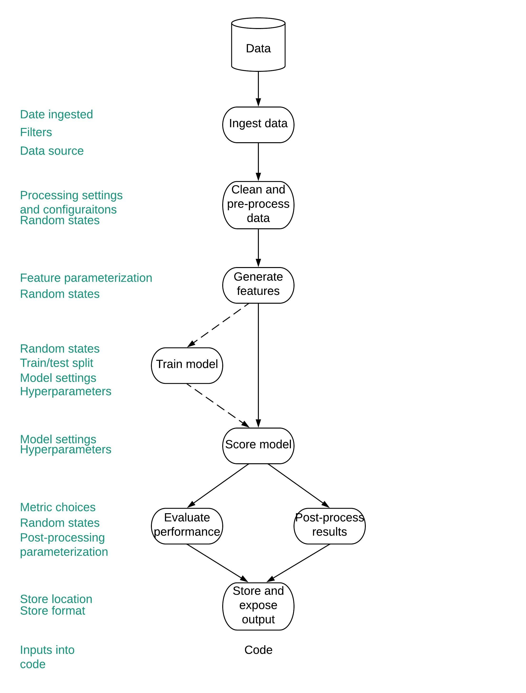
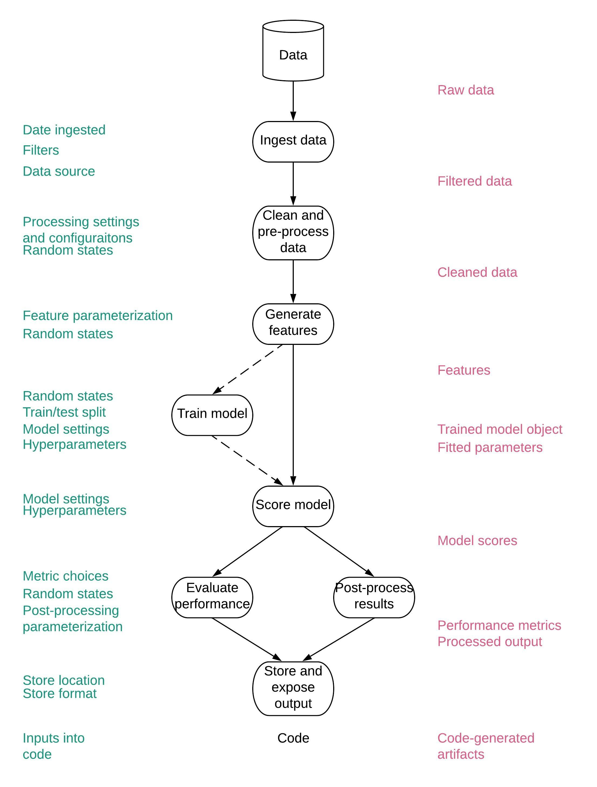
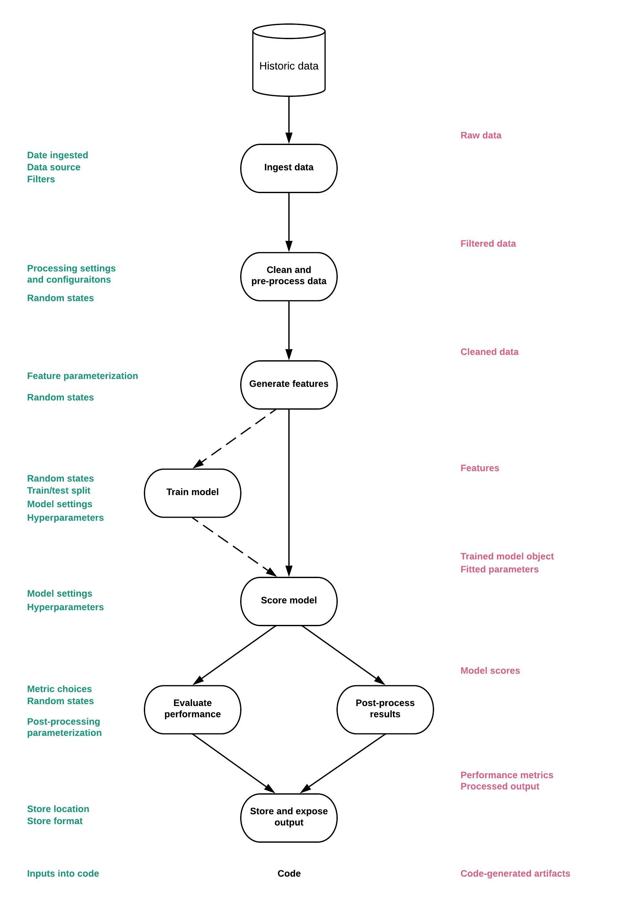
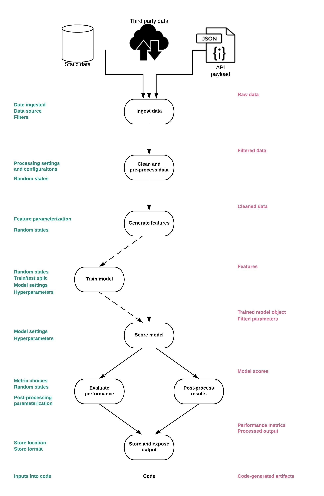

## The ingredients of a reproducible machine learning model

</br>
</br> 

#### Chloe Mawer, PhD

##### Principal Data Scientist, *Lineage Logistics*

##### Adjunct Lecturer, Masters of Science in Analytics, *Northwestern University* 

# Irreproducibility in the wild 

## 


::: notes

The world of deployment is not the same as that of development 

* **Code**: If you're lucky (and if you can help it), the two can be written in the same language, but in many cases this is not true 

	* If you're handing off your code to another team, they won't have the context for what your model is doing. They won't know why you made the choices you did, and they can get lost in translation. They also won't know that the results aren't supposed to look like that  
	
	* Changes to code have to occur to handle new requirements (e.g. changes in input/output - see *data*); to add logging, testing, and exception handling (though of course you as a data scientist are doing that anyway!)

* **Data**: Often you're getting your historic training data through something like Impala or Hive from some kind of database. Sometimes, it'll be CSVs, dumps from APIs. But, often the input data when you're scoring is being fed from a different mechanism. Instead of panda's `read_sql` or `read_csv`, you're loading a JSON, XML, or some other format. Data types, null handling, and other idiosyncrasies of the data can impact your model predictions in different ways 

* **Configuration**:  a lot of manually configured numbers can get lost along the way. Example: my scaling blunder (but money maker). 

:::

##


----

[How to write unmaintainable code](https://github.com/Droogans/unmaintainable-code) by *Roedy Green*

::: notes
* I once worked at a client where 60% of the algorithms code base was written by a single guy who apparently despised any kind of documentation 

* and wrote code like he was following this manual

* ... he left the day week after our team arrived.  No one was able to reproduce the models he had in production in the months that we were there 

* and because they were so intertwined, no model could be created that produced the same or better results. 

:::

##  


::: notes 
* And at the end of the day, fast forward your own head 6 months and vast amounts of code later, and without the proper preparation, you won't be able to reproduce your models either 

* Or even a few days later, if you've iterated through 100 different versions of models and realize that model last week was the best - too many times to count I at least have not been able to figure out which one it was!  
::: 

# Why is this so hard? 

## Randomness is everywhere  
</br>

::: incremental
* Sampling of data for training 
* Train/test split 
* Model initialization 
* Sampling of data within algorithm 
* Order of exposure of the model in training to the data
* Sampling of data for evaluation and cross validation 
* And more! 
:::

::: notes
* Sampling of data for training 
	* Either beforehand to handle data size
	* Beforehand to balance dataset

* Train/test split 

* Model initialization: 
	* Initial locations for cluster centroids in Kmeans 

* Sampling of data within algorithm
	* Random forests 
	* Solving of optimizers 

* Order of exposure of the model in training to the data
	* Especially in neural nets 

* Sampling of data for evaluation and cross validation 
:::

## The path is long   
<div id='center-image' style='text-align:center'>

</div> 

::: notes 
* People have got this whole reproducible software thing pretty well figured out! 
* Git solves all problems !
* Why is this any different? 

:::

##  



::: notes
* Well, for one thing, the level of parameterization is pretty huge
* Lots of parameters for each step along the way 
* These parameters change over time and with each iteration of a model (whether during dev or a retraining)
* 
:::

##    




::: notes
* Also, there are a ton of intermediate artifacts
* If you lose one of these, your ability to trace the origin of a reproducibility problem 

::: 

# Ingredients of a reproducible model 

# Determinism 

## Find every random state and parameterize it 

# Versioning of everything 

## Versioning code is not enough 

## 

```
├── src                               <- Source data for the model 
│   ├── ingest_data.py                <- Script for ingesting data from different sources 
│   ├── generate_features.py          <- Script for cleaning and transforming data for use in training and scoring.
│   ├── train_model.py                <- Script for training machine learning model(s)
│   ├── score_model.py                <- Script for scoring new predictions using a trained model.
│   ├── postprocess.py                <- Script for postprocessing predictions and model results
│   ├── evaluate_model.py             <- Script for evaluating model performance 
│
├── run.py                            <- Simplifies the execution of one or more of the src scripts 
├── requirements.txt                  <- Python package dependencies 
```

## Parameters and settings 

```yaml
model:  
  name: example-model  
  author: Chloe Mawer  
  version: AA1  
  description: Predicts a random result given some arbitrary data inputs as an example of this config file  
  tags:  
    - classifier  
    - housing  
  dependencies: requirements.txt  
load_data:  
  how: csv  
  csv:  
    path: data/sample/boston_house_prices.csv  
    usecols: [CRIM, ZN, INDUS, CHAS, NOX, RM, AGE, DIS, RAD, TAX, PTRATIO, B, LSTAT]  
generate_features:  
  make_categorical:  
    columns: RAD  
    RAD:  
      categories: [1, 2, 3, 5, 4, 8, 6, 7, 24]  
      one_hot_encode: True  
  bin_values:  
    columns: CRIM  
    quartiles: 2  
  save_dataset: test/test/boston_house_prices_processed.csv  
train_model:  
  method: xgboost  
  choose_features:  
    features_to_use: [ZN, INDUS, CHAS, NOX, RM, AGE, DIS, RAD, TAX, PTRATIO]  
  get_target:  
    target: CRIM  
  split_data:  
    train_size: 0.5  
    test_size: 0.25  
    validate_size: 0.25  
    random_state: 24  
    save_split_prefix: test/test/example-boston  
  params:  
    max_depth: 100  
    learning_rate: 50  
    random_state: 1019  
  fit:  
    eval_metric: auc  
    verbose: True  
  save_tmo: models/example-boston-crime-prediction.pkl  
evaluate_model:  
  metrics: [auc, accuracy, logloss]
```

## `config.yml`

```yaml
pyfileA:
	functionA:
		variableAA: value
		variableAB: value
	functionB:
		variableBA: value
		variableBB: value
	save_results: path/to/saveoutput.csv
```

. . .

```python
import yaml
import pyfileA as pa

with open("config.yml", "r") as f:
	config = yaml.load(f)

config_pyA = config["pyfileA"]
df = functionA(df, **config_pyA["functionA"])
df = functionB(df, **config_pyA["functionB"])
if "save_results" in config_pyA:
	df.to_csv(config_pyA["save_results"])
```

::: notes

* Be explicit in your YAML structure of the exact files and functions you are using 
* Use the exact variable names 
* You can expand a dict into the arguments for a given 

::: 

## Data
::: incremental 
* At minimum, version an _explicit_ query and include in configuration filters used.
* Source data can change so even this is not sufficient in many cases. 
* Ideally, you can version the entire training dataset through tools like `gitlfs`, `S3` or your own tables in HDFS or the database of your choosing. 

:::

::: notes 

* Query versioning does not cut it when the underlying data is changing. 
* `WHERE date > "2019-01-01"` gives different results every time. 

:::


## Features 

::: incremental 
* If it changes, the downstream models change too. 
* Often a feature is the output of another model.
* Ideally each feature should be treated this way and managed accordingly. 

:::

## Auxiliary data 

::: incremental 
* Models can be highly dependent on auxiliary data, such as the options for categorical variables. 
* If this data gets out of sync with the model files or code, it can cause code to fail.

::: 

::: notes 

* Example: one-hot encoding categories 

:::


## Trained model objects 

::: notes

* Size depends on model - do the same with it as data so you stay consistent 

:::

## Workflows

::: incremental 
* Something needs to remember how the steps were stringed together.
* Use tools like Make files, Airlflow, Luigi and version them.

:::

## Version them all together 
* Commit hashes
* Manually cultivated version list
* Dates 

# Reproducibility testing 

## Traditional software testing is not enough 
(Though you should definitely do it still!) 

## Model testing 


```yaml
train_model:  
  command:  python run.py train_model --config=config/example-training-config.yml --csv=test/test/boston_house_prices_processed.csv  
  true_dir: test/true/  
  test_dir: test/test/  
  files_to_compare:  
    - example-boston-train-features.csv  
    - example-boston-train-targets.csv  
    - example-boston-test-features.csv  
    - example-boston-test-targets.csv  
    - example-boston-validate-features.csv  
    - example-boston-validate-targets.csv  
	- example-boston-fitted-params.yml
  ```
  
## 

```yaml
generate_features:  
  command: python run.py generate_features --config=config/example-training-config.yml  
  true_dir: test/true/  
  test_dir: test/test/  
  files_to_compare:  
    - boston_house_prices_processed.csv  
train_model:  
  command:  python run.py train_model --config=config/example-training-config.yml --csv=test/test/boston_house_prices_processed.csv  
  true_dir: test/true/  
  test_dir: test/test/  
  files_to_compare:  
    - example-boston-train-features.csv  
    - example-boston-train-targets.csv  
    - example-boston-test-features.csv  
    - example-boston-test-targets.csv  
    - example-boston-validate-features.csv  
    - example-boston-validate-targets.csv  
    - example-boston-fitted-params.yml
score_model:  
  command:  python run.py score_model --csv=test/test/example-boston-validate.csv --config=config/example-training-config.yml  
  true_dir: test/true/  
  test_dir: test/test/  
  files_to_compare:  
    - example_boston_scores.csv
  ```

# Environment management 

## `requirements.txt`

## `conda`


::: notes
* Separate out your development environment from your model
* Usually when you move to scripts 

::: 

# Code alignment 

##  



##  



# Thank you! 

##  Thank you! 

 </br>
	
You can find these slides at </br> [https://cmawer.github.io/reproducible-model](https://cmawer.github.io/reproducible-model)
 
 </br>

and the reproducible model template repo at </br> [https://github.com/cmawer/reproducible-model](https://github.com/cmawer/reproducible-model)

</br>


Chloe Mawer | Lineage Logistics 

cmawer@lineagelogistics.com | @cmawer 
